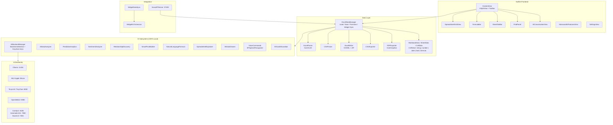
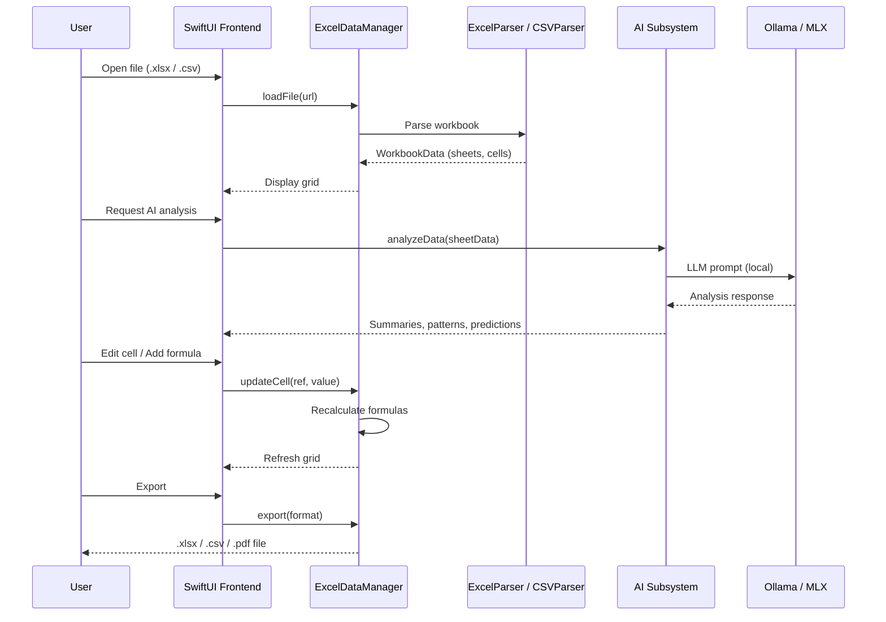

# ExcelExplorer

A native macOS spreadsheet viewer, editor, and analyzer with local AI processing. Opens .xlsx, .xls, and .csv files, provides full OOXML XLSX export, and runs AI-powered data analysis entirely on-device.


---

## Features

| Feature | Description |
|---------|-------------|
| File formats | Open and edit .xlsx (CoreXLSX), .xls, and .csv files |
| Cell editing | Inline editing for strings, numbers, dates, booleans, and formulas |
| Formula engine | SUM, AVERAGE, COUNT, MIN, MAX with cell range references and auto-recalculation |
| Multi-sheet navigation | Tab bar for switching worksheets, sheet add/remove |
| Search and filter | Find text across sheets, sort by column, filter rows, detect duplicates |
| XLSX export | Full Office Open XML writer (Content_Types, workbook, shared strings, per-sheet XML, ZIP packaging) |
| CSV export | Configurable delimiters |
| PDF export | CoreGraphics-based multi-page PDF generation |
| AI data summarization | Natural-language summaries of datasets |
| AI pattern detection | Trend, anomaly, and outlier identification |
| Predictive analytics | Time-series forecasting with linear regression, seasonality, confidence intervals |
| Sentiment analysis | NaturalLanguage framework + LLM-backed text scoring |
| Relationship discovery | Foreign key and correlation detection across sheets |
| Smart pivot builder | AI-generated pivot table suggestions |
| Natural language formulas | Describe what you want in English; AI writes the formula |
| Spreadsheet explainer | One-click explanation of spreadsheet structure and contents |
| Data cleaning | AI-assisted detection of formatting issues, missing values, type mismatches |
| Chart generation | AI-suggested visualizations from selected data ranges |
| Conversational AI | Chat sidebar for natural-language questions about your data |
| Voice commands | Hands-free spreadsheet control via SFSpeechRecognizer |
| Image generation | Chart and visualization generation via ComfyUI, Automatic1111, or SwarmUI |
| Desktop widget | WidgetKit extension (Small / Medium / Large) with current file, recent files, AI status |
| Deep links | `excelexplorer://open?path=`, `excelexplorer://recent`, `excelexplorer://analyze` |
| Nova API server | HTTP API on port 37430 (loopback only) |

---

## Architecture



### Data Flow



---

## Installation

1. Download the latest DMG from [Releases](https://github.com/kochj23/ExcelExplorer/releases)
2. Open the DMG and drag ExcelExplorer.app to `/Applications`
3. No sandbox -- direct distribution via DMG

### Optional: AI Backend

```bash
# Ollama (recommended)
brew install ollama && ollama pull llama3

# MLX (Apple Silicon only)
pip install mlx-lm
```

## Requirements

| Requirement | Minimum |
|-------------|---------|
| macOS | 14.0 (Sonoma) |
| Architecture | Universal (Apple Silicon recommended for MLX) |
| CoreXLSX | Swift Package (resolved automatically by Xcode) |
| AI (optional) | Ollama, MLX, TinyLLM, or any supported backend |

---

## Building

```bash
git clone git@github.com:kochj23/ExcelExplorer.git
cd ExcelExplorer
xcodebuild -project ExcelExplorer.xcodeproj -scheme ExcelExplorer -configuration Release build
```

Swift Package dependencies (CoreXLSX) resolve automatically on first build.

## Testing

```bash
xcodebuild -project ExcelExplorer.xcodeproj -scheme ExcelExplorer -destination 'platform=macOS' test
```

212 tests across 10 test classes covering unit, security, functional, and integration categories:

| Test Class | Tests | Category |
|------------|------:|----------|
| EthicalAIGuardianTests | 30 | Security -- prohibited content patterns, false positive avoidance, regex validation |
| CellDataTests | 29 | Unit -- CellReference notation, CellValue types, Codable, formatting defaults |
| FrameTests | 28 | Frame -- app launch, view instantiation, widget data models |
| SheetDataTests | 24 | Unit -- grid access, row/column insert/delete, bounds checking, column statistics |
| ExcelDataManagerTests | 24 | Unit -- value parsing, formula engine (SUM/AVG/COUNT/MIN/MAX), dirty tracking, sheet navigation |
| SecurityTests | 21 | Security -- formula injection, path traversal, XML injection, bounds safety, API key audit, entitlements |
| CSVParserTests | 20 | Unit -- type detection (string/number/date/bool), quoted fields, empty/large files, performance |
| ExportTests | 17 | Functional -- CSV/XLSX/PDF export, XML escaping, ZIP validation, round-trip integrity |
| WorkbookDataTests | 11 | Unit -- sheet management, metadata, workbook mutations |
| IntegrationTests | 8 | Integration -- open/edit/export flows, multi-sheet navigation, formula recalculation, large datasets |

---

## Keyboard Shortcuts

| Action | Shortcut |
|--------|----------|
| Open File | Cmd+O |
| Save | Cmd+S |
| Export to Excel | Cmd+E |
| Find | Cmd+F |
| Toggle AI Panel | Cmd+I |
| Explain Spreadsheet | Cmd+Shift+E |
| Find Insights | Cmd+Shift+I |
| Generate Report | Cmd+Shift+R |
| Clean Data | Cmd+Shift+L |
| Natural Language Formula | Cmd+Shift+N |
| Advanced AI Features | Cmd+Shift+B |
| Zoom In/Out/Reset | Cmd+/- / Cmd+0 |

---

## Nova API Server

Port **37430** (127.0.0.1 loopback only). No authentication required.

| Method | Path | Description |
|--------|------|-------------|
| `GET` | `/api/status` | App status, version, uptime |
| `GET` | `/api/ping` | Health check |

```bash
curl -s http://127.0.0.1:37430/api/status | python3 -m json.tool
```

---

## License

MIT License -- Copyright (c) 2026 Jordan Koch

See [LICENSE](LICENSE) for the full text.

---

Written by Jordan Koch ([@kochj23](https://github.com/kochj23))

> Disclaimer: This is a personal project created on my own time. It is not affiliated with, endorsed by, or representative of my employer.
